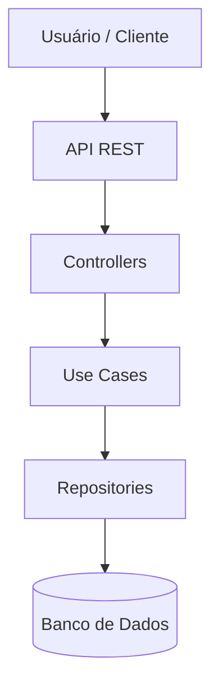
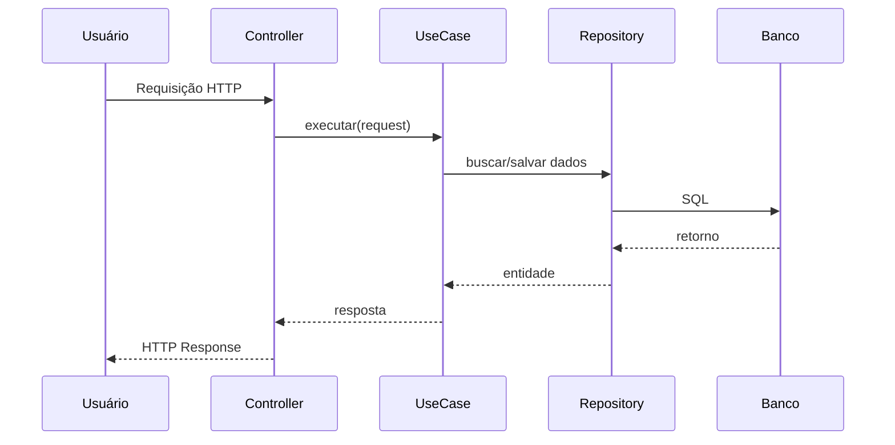
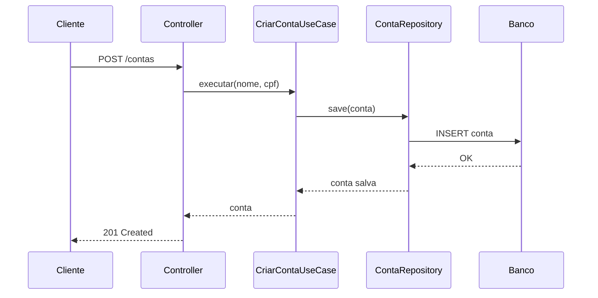
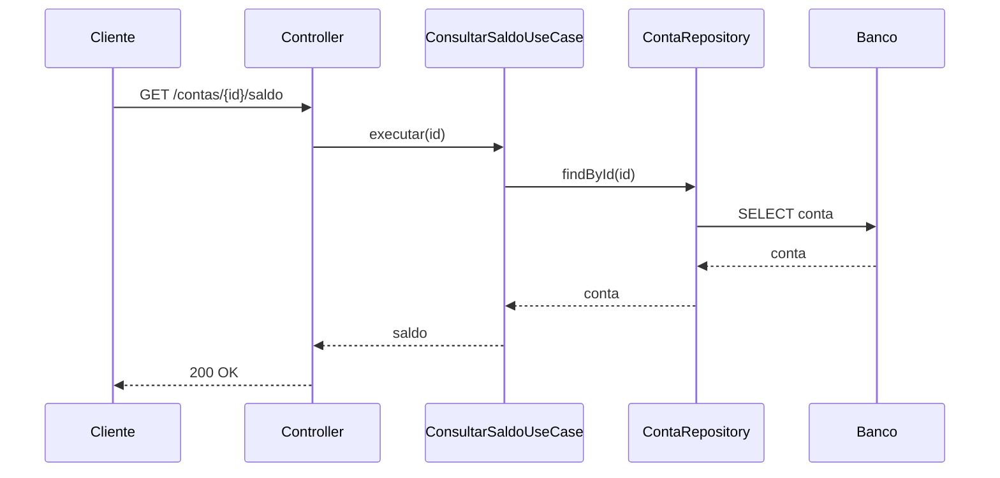
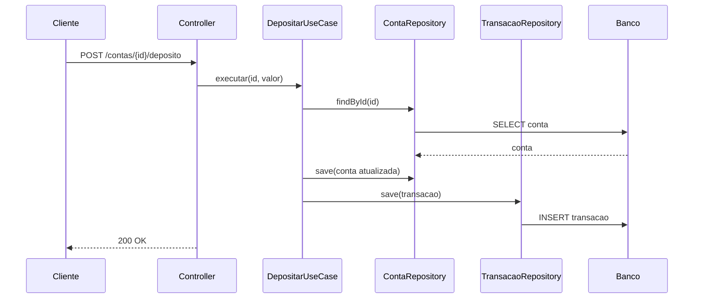
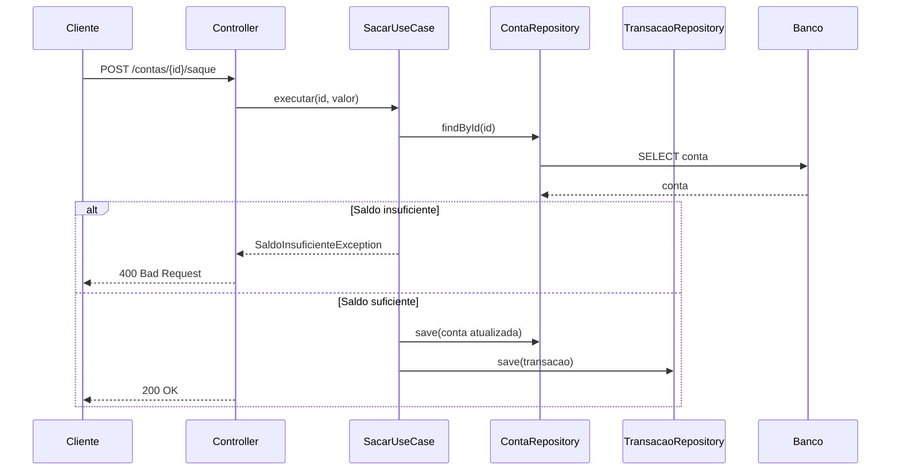
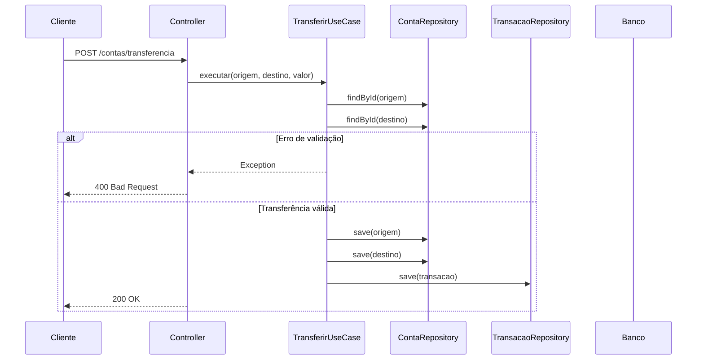
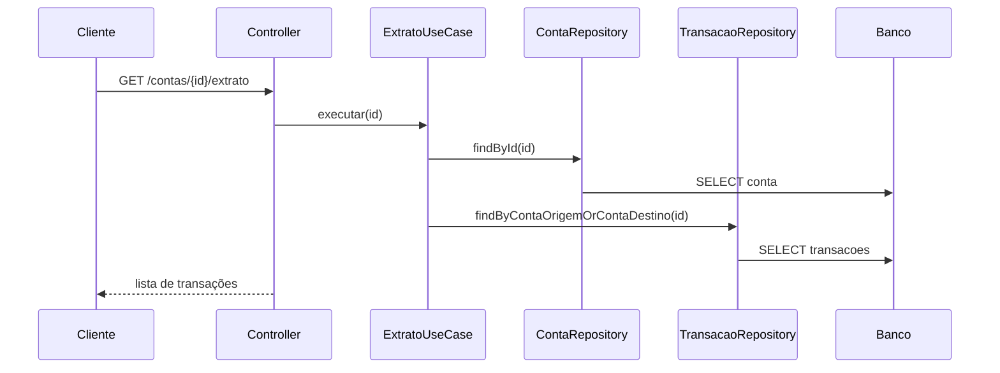

# API Banco Digital

Esta API REST foi desenvolvida com o objetivo de simular as principais operações de um sistema bancário digital, como criação de contas, consulta de saldo, depósitos, saques, transferências e consulta de extrato.

A aplicação foi construída utilizando Java e Spring Boot, adotando o padrão de Use Cases para isolar as regras de negócio da camada de apresentação, promovendo maior organização, manutenibilidade e facilidade de testes.

O projeto aplica boas práticas de desenvolvimento de software, como separação de responsabilidades, tratamento centralizado de exceções e uso de DTOs, garantindo clareza e consistência na comunicação entre as camadas da aplicação.





## Tecnologias Utilizadas

- Java 17+
- Spring Boot
- Spring Web
- Spring Data JPA
- Hibernate
- H2 Database
- Lombok
- Maven


## Arquitetura do Projeto

O projeto segue o padrão **Use Case (Application Layer)**, evitando lógica de negócio em controllers ou services tradicionais.

com.demo.banco  
├── controller → Camada REST (endpoints)  
├── usecase → Regras de negócio  
├── model → Entidades JPA  
├── repository → Repositórios JPA  
├── dto → Requests / Responses  
└──exception → Exceções de negócio  


##  Entidades Principais

### Conta

Representa uma conta bancária.


A conta é criada com:
- saldo inicial **0.00**
- status **ATIVA**
- data de abertura automática do dia atual


### Transacao

Registra todas as movimentações financeiras (depósitos, saques, transferências).


## Use Cases Implementados

###  Criar Conta

**Use Case:** `CriarContaUseCase`

**Entrada**
- Nome do titular
- CPF

**Saída**
- Conta criada

**Regras**
- Saldo inicial 0.00
- Status ATIVA
- Data de abertura automática



---

### Consultar Saldo

**Use Case:** `ConsultarSaldoUseCase`

**Entrada**
- ID da conta

**Saída**
- Saldo atual

**Regra**
- Conta deve existir



---

### Depositar

**Use Case:** `DepositarUseCase`

**Entrada**
- ID da conta
- Valor

**Saída**
- Saldo atualizado

**Regras**
- Valor deve ser positivo
- Conta deve existir
- Gera transação do tipo **DEPÓSITO**


---

### Sacar

**Use Case:** `SacarUseCase`

**Entrada**
- ID da conta
- Valor

**Saída**
- Saldo atualizado

**Regras**
- Valor deve ser positivo
- Conta deve existir
- Saldo deve ser suficiente
- Gera transação do tipo **SAQUE**


---

### Transferir

**Use Case:** `TransferirUseCase`

**Entrada**
- ID da conta origem
- ID da conta destino
- Valor

**Saída**
- Saldo atualizado da conta de origem

**Regras**
- Não pode transferir para a mesma conta
- Valor deve ser positivo
- Conta origem deve existir
- Conta destino deve existir
- Saldo da origem deve ser suficiente
- Gera transação do tipo **TRANSFERÊNCIA**


---

### Extrato

**Use Case:** `ExtratoUseCase`

**Entrada**
- ID da conta

**Saída**
- Lista de transações

**Regras**
- Conta deve existir
- Retorna transações onde a conta é origem ou destino



## Tratamento de Exceções

O projeto utiliza **exceções de negócio customizadas**, tratadas globalmente.

### Exceções

- `ContaNaoEncontradaException`
- `SaldoInsuficienteException`
- `ValorTransferenciaException`
- `TransferenciaMesmaContaException`


## Endpoints Disponíveis

### Criar Conta
POST /contas
```json
{
  "nomeTitular": "Maria Silva",
  "cpf": "12345678900"
}
```

### Consultar Saldo
GET /contas/{id}/saldo

### Depositar
POST /contas/{id}/depositar
```json
{
  "valor": 200.00
}
```

### Sacar
POST /contas/{id}/sacar
```json
{
  "valor": 50.00
}
```

### Transferir
POST /contas/{id}/transferir
```json
{
  "contaDestino": 2,
  "valor": 100.00
}
```

### Extrato
GET /contas/{id}/extrato
