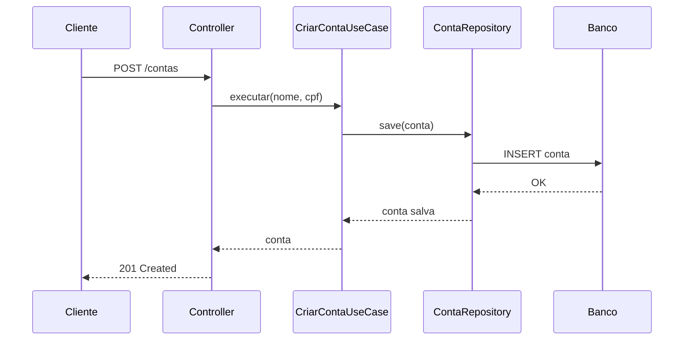
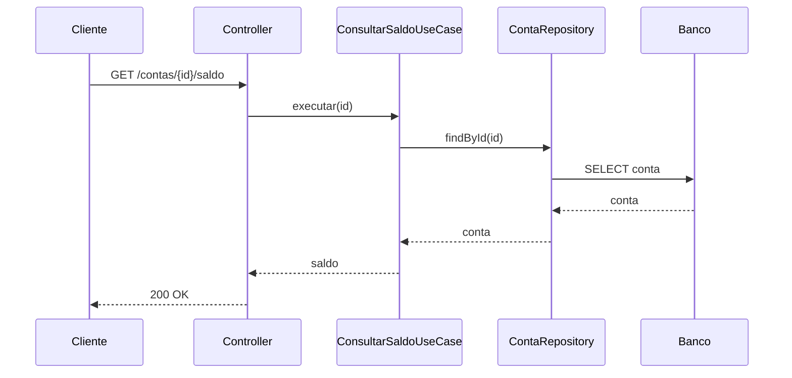
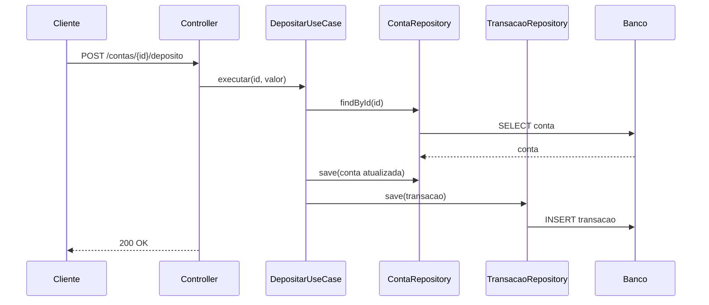
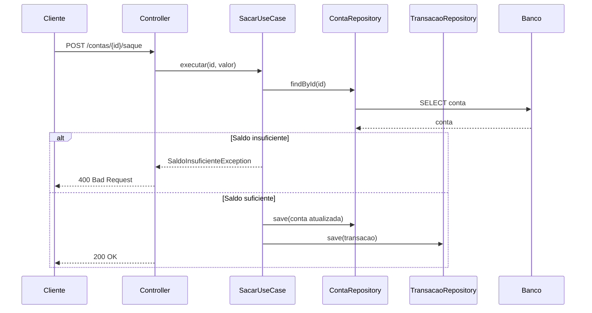
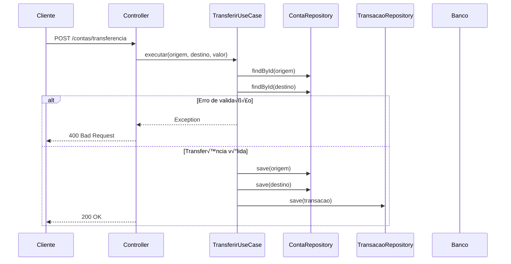
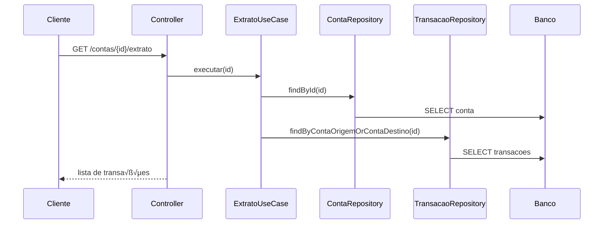

# 🏦 API Banco Digital

API REST para simular operações básicas de um **banco digital**, desenvolvida em **Java com Spring Boot**, seguindo princípios de **Clean Architecture / Use Cases**, separando regras de negócio da camada de infraestrutura.

---

## Tecnologias Utilizadas

- Java 17+
- Spring Boot
- Spring Web
- Spring Data JPA
- Hibernate
- H2 Database
- Lombok
- Maven

---

## Arquitetura do Projeto

O projeto segue o padrão **Use Case (Application Layer)**, evitando lógica de negócio em controllers ou services tradicionais.

com.demo.banco
│
├── controller → Camada REST (endpoints)
├── usecase → Regras de negócio
├── model → Entidades JPA
├── repository → Repositórios JPA
├── dto → Requests / Responses
└──exception → Exceções de negócio

---

##  Entidades Principais

### Conta

Representa uma conta banc√°ria.


A conta é criada com:
- saldo inicial **0.00**
- status **ATIVA**
- data de abertura autom√°tica do dia atual

---

### Transacao

Registra todas as movimentações financeiras (depósitos, saques, transferências).

---

## Use Cases Implementados

###  Criar Conta

**Use Case:** `CriarContaUseCase`

**Entrada**
- Nome do titular
- CPF

**Saída**
- Conta criada

**Regras**
- Saldo inicial 0.00
- Status ATIVA
- Data de abertura autom√°tica


```mermaid
sequenceDiagram
    participant Cliente
    participant Controller
    participant CriarContaUseCase
    participant ContaRepository
    participant Banco

    Cliente ->> Controller: POST /contas
    Controller ->> CriarContaUseCase: executar(nome, cpf)
    CriarContaUseCase ->> ContaRepository: save(conta)
    ContaRepository ->> Banco: INSERT conta
    Banco -->> ContaRepository: OK
    ContaRepository -->> CriarContaUseCase: conta salva
    CriarContaUseCase -->> Controller: conta
    Controller -->> Cliente: 201 Created
```

---

### Consultar Saldo

**Use Case:** `ConsultarSaldoUseCase`

**Entrada**
- ID da conta

**Saída**
- Saldo atual

**Regra**
- Conta deve existir


```mermaid
sequenceDiagram
    participant Cliente
    participant Controller
    participant ConsultarSaldoUseCase
    participant ContaRepository
    participant Banco

    Cliente ->> Controller: GET /contas/{id}/saldo
    Controller ->> ConsultarSaldoUseCase: executar(id)
    ConsultarSaldoUseCase ->> ContaRepository: findById(id)
    ContaRepository ->> Banco: SELECT conta
    Banco -->> ContaRepository: conta
    ContaRepository -->> ConsultarSaldoUseCase: conta
    ConsultarSaldoUseCase -->> Controller: saldo
    Controller -->> Cliente: 200 OK
```

---

### Depositar

**Use Case:** `DepositarUseCase`

**Entrada**
- ID da conta
- Valor

**Saída**
- Saldo atualizado

**Regras**
- Valor deve ser positivo
- Conta deve existir
- Gera transação do tipo **DEPÓSITO**


```mermaid
sequenceDiagram
    participant Cliente
    participant Controller
    participant DepositarUseCase
    participant ContaRepository
    participant TransacaoRepository
    participant Banco

    Cliente ->> Controller: POST /contas/{id}/deposito
    Controller ->> DepositarUseCase: executar(id, valor)
    DepositarUseCase ->> ContaRepository: findById(id)
    ContaRepository ->> Banco: SELECT conta
    Banco -->> ContaRepository: conta
    DepositarUseCase ->> ContaRepository: save(conta atualizada)
    DepositarUseCase ->> TransacaoRepository: save(transacao)
    TransacaoRepository ->> Banco: INSERT transacao
    Controller -->> Cliente: 200 OK
```
---

### Sacar

**Use Case:** `SacarUseCase`

**Entrada**
- ID da conta
- Valor

**Saída**
- Saldo atualizado

**Regras**
- Valor deve ser positivo
- Conta deve existir
- Saldo deve ser suficiente
- Gera transação do tipo **SAQUE**


```mermaid
sequenceDiagram
    participant Cliente
    participant Controller
    participant SacarUseCase
    participant ContaRepository
    participant TransacaoRepository
    participant Banco

    Cliente ->> Controller: POST /contas/{id}/saque
    Controller ->> SacarUseCase: executar(id, valor)
    SacarUseCase ->> ContaRepository: findById(id)
    ContaRepository ->> Banco: SELECT conta
    Banco -->> ContaRepository: conta

    alt Saldo insuficiente
        SacarUseCase -->> Controller: SaldoInsuficienteException
        Controller -->> Cliente: 400 Bad Request
    else Saldo suficiente
        SacarUseCase ->> ContaRepository: save(conta atualizada)
        SacarUseCase ->> TransacaoRepository: save(transacao)
        Controller -->> Cliente: 200 OK
    end
```
---

### Transferir

**Use Case:** `TransferirUseCase`

**Entrada**
- ID da conta origem
- ID da conta destino
- Valor

**Saída**
- Saldo atualizado da conta de origem

**Regras**
- N√£o pode transferir para a mesma conta
- Valor deve ser positivo
- Conta origem deve existir
- Conta destino deve existir
- Saldo da origem deve ser suficiente
- Gera transação do tipo **TRANSFERÊNCIA**


```mermaid
sequenceDiagram
    participant Cliente
    participant Controller
    participant TransferirUseCase
    participant ContaRepository
    participant TransacaoRepository
    participant Banco

    Cliente ->> Controller: POST /contas/transferencia
    Controller ->> TransferirUseCase: executar(origem, destino, valor)

    TransferirUseCase ->> ContaRepository: findById(origem)
    TransferirUseCase ->> ContaRepository: findById(destino)

    alt Erro de validação
        TransferirUseCase -->> Controller: Exception
        Controller -->> Cliente: 400 Bad Request
    else Transferência válida
        TransferirUseCase ->> ContaRepository: save(origem)
        TransferirUseCase ->> ContaRepository: save(destino)
        TransferirUseCase ->> TransacaoRepository: save(transacao)
        Controller -->> Cliente: 200 OK
    end
```
---

### Extrato

**Use Case:** `ExtratoUseCase`

**Entrada**
- ID da conta

**Saída**
- Lista de transações

**Regras**
- Conta deve existir
- Retorna transações onde a conta é origem ou destino


```mermaid
sequenceDiagram
    participant Cliente
    participant Controller
    participant ExtratoUseCase
    participant ContaRepository
    participant TransacaoRepository
    participant Banco

    Cliente ->> Controller: GET /contas/{id}/extrato
    Controller ->> ExtratoUseCase: executar(id)
    ExtratoUseCase ->> ContaRepository: findById(id)
    ContaRepository ->> Banco: SELECT conta

    ExtratoUseCase ->> TransacaoRepository: findByContaOrigemOrContaDestino(id)
    TransacaoRepository ->> Banco: SELECT transacoes
    Controller -->> Cliente: lista de transações
```
---

## Tratamento de Exceções

O projeto utiliza **exceções de negócio customizadas**, tratadas globalmente.

### Exceções

- `ContaNaoEncontradaException`
- `SaldoInsuficienteException`
- `ValorTransferenciaException`
- `TransferenciaMesmaContaException`

Todas retornam mensagens claras e **status HTTP apropriados**.

---

## Endpoints Disponíveis

### Criar Conta
POST /contas
```json
{
  "nomeTitular": "Maria Silva",
  "cpf": "12345678900"
}

### Consultar Saldo
GET /contas/{id}/saldo

### Depositar
POST /contas/{id}/depositar
```json
{
  "valor": 200.00
}

### Sacar
POST /contas/{id}/sacar
```json
{
  "valor": 50.00
}

### Transferir
POST /contas/{id}/transferir
```json
{
  "contaDestino": 2,
  "valor": 100.00
}

### Extrato
GET /contas/{id}/extrato

---


